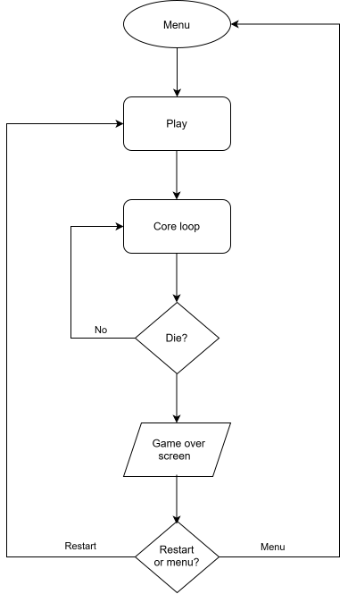

# FLIP - Game Design Document

Last updated: 09/09/2026
Author: Jack Moocarme

## 1. Concept

A simple obstacle avoiding game with a gravity mechanic, a button flips the gravity of your character and allows you to avoid otherwise unavoidable obstacles. As you avoid the spikes, the scene is filled with gems that you can pick up to increase your score, with the difficulty of the game increasing as time goes on.

The game serves as a first game project for me, and also the first time using Godot and exploring simple art creation for game creation.

## 2. Core game loop

## 3. Controls

| Action        | Input        | Notes                                                                                |
|---------------|--------------|--------------------------------------------------------------------------------------|
| Start game    | Space / click| From the main menu pressing start will begin the game.                               |
| Flip gravity  | Space / click| Each press has a short cooldown to prevent button mashing, which may cause an issue. |
| Restart game  | R            | Restarts the game from the game over screen.                                         |
| Return to menu| Esc          | Returns from the game over screen back to the main menu.                             |

## 4. Player

The current idea is for the player to control a "ship" while playing, potentially a little rocket or something similar that they can control and flip the gravity to pick up gems and diamonds and avoid the spikes.

Right now the only mechanic will be to flip gravity and move from bottom to top and vice versa, but maybe we can add functioanlity later for some movement.

## 5. World

The world is an endless scrolling tunnel that is made up of different segment types, like straights, zigzags, areas of big gems and areas of lots of obstacles.

Right now these areas can be deterministic i.e. each big gem area is the same, but later it could be nice to introduce some sort of random mechanic for each region to make the game feel more alive and less stale/repetitive.

As the game progresses the difficulty should ramp up to match this, we can do this by either time or distance travelled, depending on the changes to the game later on. How this difficulty ramp will work is yet to be decided.

Each segment should always be completable no matter what came before it to avoid extraneous work deciding what segments can go where, which could be a pressure point when the randomness comes into play.

## 6. Obstacles and pickups

## 6. Obstacles & pickups

| Object | Behaviour             | Points | Notes                                                     |
|--------|-----------------------|--------|-----------------------------------------------------------|
| Spike  | Kills on contact      | —      | Causes the player to die and presents game over screen.   |
| Gem    | Collects on overlap   | +10    | Effects on pickup and nice sparkle animations.            |

- Scoring right now will be flat (once you hit a gem its +10), potential for chained scoring? (i.e. 2 gems in a row is 10 + (10 * 1.1?))

## 7. Difficulty curve

The game should feel easy to begin with and get more difficult, but having a game that you cannot last for more than 30-60s could get boring quickly, but so would a game that you can last 30 minutes at a time. Somewhere in between where its possible for good players to last a long time while still remaining difficult is a good starting point to aim for.

Playtesting came better suggest what values will achieve this.

## 8. Game feeling (juice)

Flipping is the main mechanic and so should be accompanied with clean effects and animations, including sound effects.

Gems should sparkle in the world and should have effects when picked up, and a sound effect to reflect this. If chaining is a later feature having this sound effect reflect that chaining would be nice.

Deaths should be accompanied by effects and should pause before the UI pops up to signify the player died.

Game pallete should consist of 3-5 unified colours that are used across the entire game.

## 9. Audio

Game should have SFX for (at least):

- flips
- gems
- death
- score

All audio should be correctly licensed and should be credited properly.

## 10. Scope

The first build of the game should contain just the basic features, it should be playable all the way through and should be visually obvious what things are.

Stretch goals for the game can be focused on improving it visually, performance wise and in difficulty/level design elements.

## 11. Success criteria

- The game should successfully run in a browser from the page it is hosted on with no fps issues.

- The game should be able to play from start to finish without any errors.

- Score should correctly be calculated on gem pick up and spikes should kill and reset that score.

- All documentation for the game should be up to date.

- The host page should have details about the game and accompanying screenshots where necessary.
